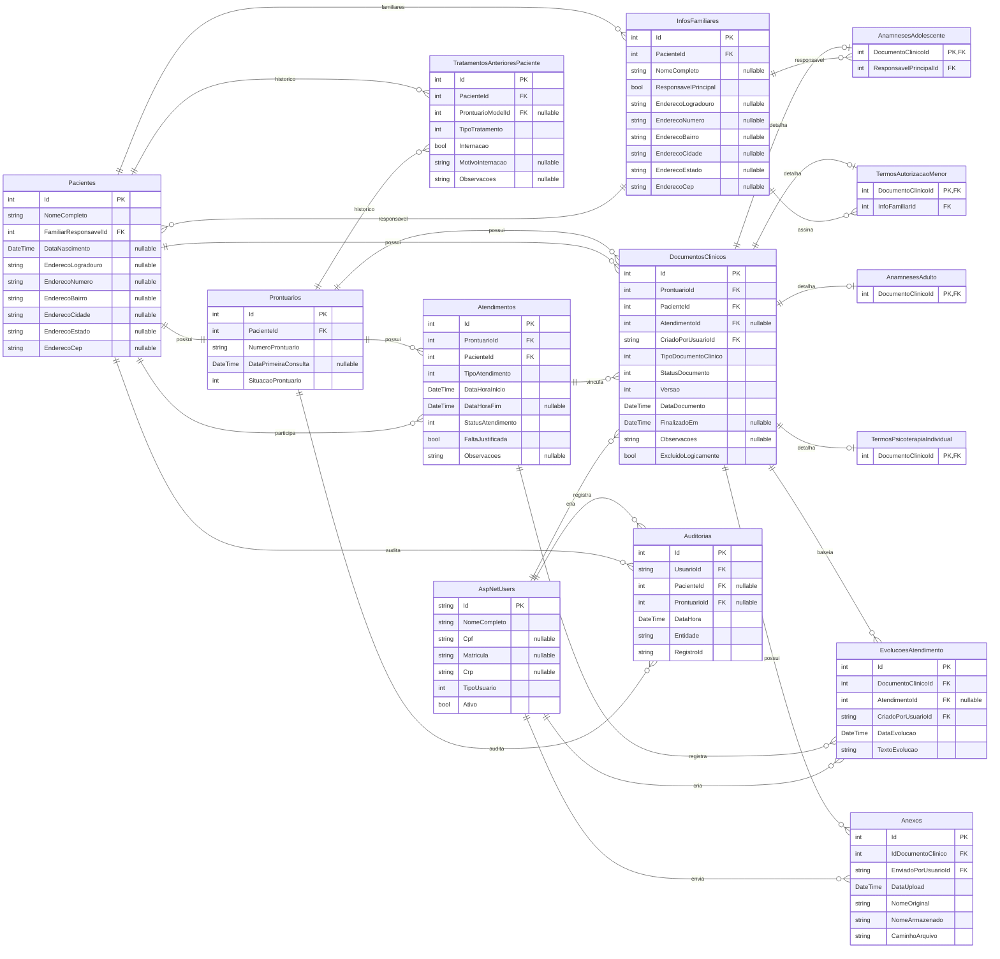

# Diagrama ER das models

`Endereco` nao entra como entidade porque e um owned type; no banco ele vira colunas dentro de `Pacientes` e `InfosFamiliares`. `DocumentoIdentificacaoPaciente` esta comentado no codigo e nao faz parte do schema atual.

